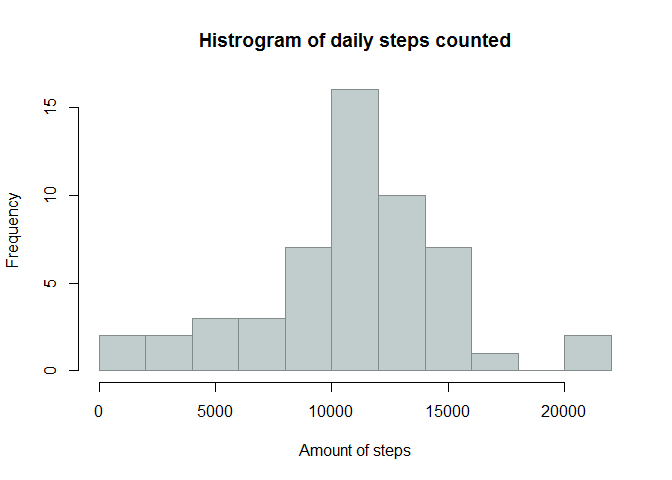
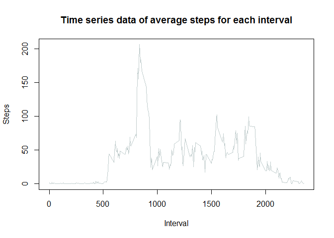
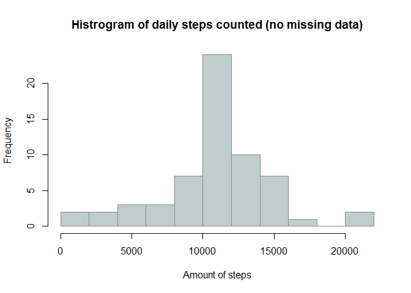
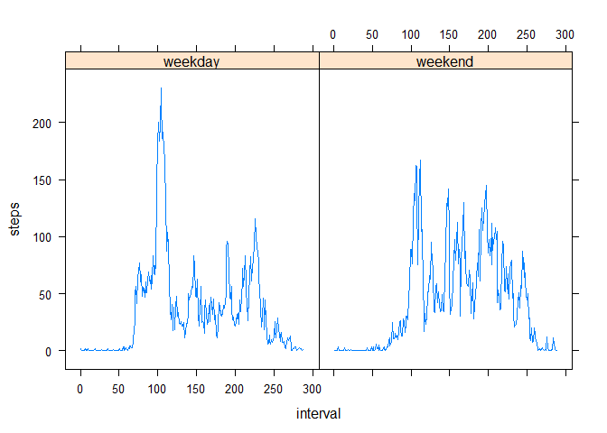

# Reproducible Research: Peer Assessment 1

This R markdown file is written for the first assignment of the Coursera course "[Reproducible Research](http://www.coursera.org/course/repdata)".  
The following steps describe the analysis step by step.

## Loading and preprocessing the data
First, we unzip and load the data into R.


```r
unzip("activity.zip")
activity <- read.csv("activity.csv")
```

So this is what the head of the imported data looks like:


```
##      steps                date          interval     
##  Min.   :  0.00   2012-10-01:  288   Min.   :   0.0  
##  1st Qu.:  0.00   2012-10-02:  288   1st Qu.: 588.8  
##  Median :  0.00   2012-10-03:  288   Median :1177.5  
##  Mean   : 37.38   2012-10-04:  288   Mean   :1177.5  
##  3rd Qu.: 12.00   2012-10-05:  288   3rd Qu.:1766.2  
##  Max.   :806.00   2012-10-06:  288   Max.   :2355.0  
##  NA's   :2304     (Other)   :15840
```

## What is mean total number of steps taken per day?
To answer this question, we first calculate the total of steps for each of the days in our sample.  


```r
dailysteps <- tapply(activity$steps, activity$date, sum)
```

Next, we visualize the distribution of this data with a histogram.  

 

Finally, the **mean** and **median** of the total number of steps taken per day are the following:


```r
mean(dailysteps, na.rm=TRUE)
```

```
## [1] 10766.19
```

```r
median(dailysteps, na.rm=TRUE)
```

```
## [1] 10765
```

## What is the average daily activity pattern?

To understand the average daily patern we first need to calculate the average amount of steps for each interval.


```r
intervalAverages <- tapply(activity$steps, activity$interval, mean, na.rm=T)
```

An average day in the sample of 62 days looks like this:


```
## Warning in plot.xy(xy, type, ...): plot type 'line' will be truncated to
## first character
```

 

Next we define the interval with the highest average number of steps.


```r
maxSteps <- max(intervalAverages)
maxInterval <- names(which(intervalAverages==maxSteps))
```

As you can clearly see on the plot, the 5-minute interval, on average across all the days in the dataset, which contains the maximum number of steps is interval **835** with and average of **206.1698113** steps.  

## Imputing missing values
The presence of missing days may introduce bias into some calculations or summaries of the data.  
Therefore, we calculate and report the total number of missing values in the dataset (i.e. the total number of rows with NAs).  


```r
totalCount <- nrow(activity)
whichAreMissing <- table(complete.cases(activity))
completeCOunt <- as.numeric(whichAreMissing[2])
percentageComplete <- completeCOunt/totalCount*100
```

* Total entries: 17568 cases  
* Valid entries: 1.5264\times 10^{4} cases  
* Percentage complete: 86.8852459%  

For this exercise, we replace missing values by replacing them by the average value for that interval.


```r
activity_clean <- activity
for (i in 1:nrow(activity_clean)){
        if(is.na(activity_clean$steps[i])==TRUE){
                activity_clean$steps[i] <- 
                        intervalAverages[names(intervalAverages)==activity_clean$interval[i]]
        }
}        
```

Next, we reexamine the distribution of the total number of steps taken each day.  


```r
dailysteps_clean <- tapply(activity_clean$steps, activity_clean$date, sum)
```

 

For this clean dataset, the **mean** and **median** of the total number of steps taken per day are the following:


```r
mean(dailysteps_clean)
```

```
## [1] 10766.19
```

```r
median(dailysteps_clean)
```

```
## [1] 10766.19
```

These values do not (or barely) differ from the estimates from the first part of the assignment.


## Are there differences in activity patterns between weekdays and weekends?

First we identify which dates are weekdays.


```r
activity_clean$date <- strptime(as.character(activity_clean$date), "%Y-%m-%e")
activity_clean$weekday <- weekdays(activity_clean$date)
activity_clean$isweekend <- 
        activity_clean$weekday == unique(activity_clean$weekday)[6]|
        activity_clean$weekday == unique(activity_clean$weekday)[7]
activity_clean$daytype <- factor(activity_clean$isweekend, labels = c("weekday", "weekend"))
```


```r
activity_clean_weekdays <- activity_clean[activity_clean$day=="weekday",]
activity_clean_weekends <- activity_clean[activity_clean$day=="weekend",]

intervalAveragesWeekdays <- data.frame(
        interval = 1:length(unique(activity_clean_weekdays$interval)),
        daytype="weekday", 
        steps = tapply(activity_clean_weekdays$steps, activity_clean_weekdays$interval, mean, na.rm=T))

intervalAveragesWeekends <- data.frame(
        interval = 1:length(unique(activity_clean_weekends$interval)),
        daytype="weekend", 
        steps = tapply(activity_clean_weekends$steps, activity_clean_weekends$interval, mean, na.rm=T))

intervalMerged <- rbind(intervalAveragesWeekdays, intervalAveragesWeekends)
```

Next, we plot both weekdays and weekends to look for differences.


```r
library(lattice)
plot <- xyplot(steps ~ interval | daytype ,intervalMerged,type="l")
print(plot)
```

 


